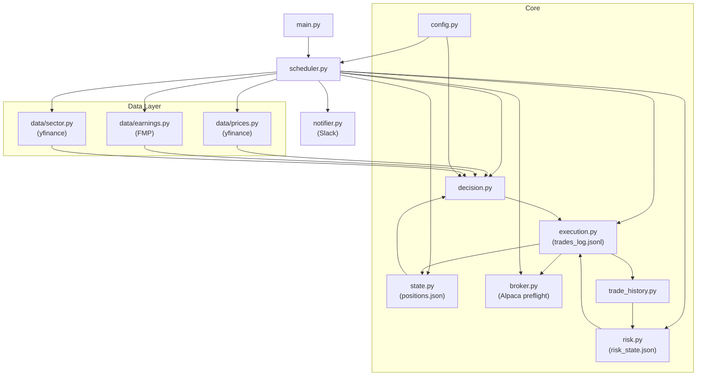

# Architecture

## Module Diagram



## Data Flow

```
prices.py   ┐
earnings.py ├──→  decision.py  ──→  execution.py
sector.py   ┤         ↑                  │
state.py ───┘                            │
    ↑                                    │
    └────────────────────────────────────┘
```

## Project Structure

```
earnings-trader/
├── src/
│   ├── data/
│   │   ├── prices.py       # yfinance: OHLCV, ATR, AH move, run-up
│   │   ├── earnings.py     # FMP: EPS/rev surprise, guidance
│   │   └── sector.py       # yfinance: sector ETF % change
│   ├── analysis/
│   │   └── track_record.py # performance stats + go/no-go verdict
│   ├── config.py           # all thresholds and parameters
│   ├── state.py            # JSON-backed position store
│   ├── decision.py         # evaluate_entry() + evaluate_positions()
│   ├── execution.py        # place_order() + execute_signals()
│   ├── risk.py             # loss limit, drawdown breaker, kill switch
│   ├── broker.py           # Alpaca preflight + position reconciliation
│   ├── trade_history.py    # trade log -> closed round trips
│   ├── scheduler.py        # APScheduler: daily cycles
│   └── main.py             # CLI entry point
├── data/                   # runtime data (gitignored)
│   ├── positions.json
│   ├── risk_state.json
│   ├── HALT                # present == entries blocked
│   └── trades_log.jsonl
├── ROADMAP.md
├── ARCHITECTURE.md
├── CLAUDE.md
└── README.md
```

## Module Interfaces

### `config.py`

All tunable constants imported by other modules. No functions — import directly.

```python
MIN_EPS_BEAT_PCT: float      # minimum EPS beat fraction (e.g. 0.05 = 5%)
MIN_AH_MOVE_PCT: float       # minimum after-hours % move (e.g. 0.03 = 3%)
MAX_PRIOR_RUNUP_PCT: float   # max allowed prior 10-day run-up (e.g. 0.10)
SECTOR_ETF_MIN: float        # minimum sector ETF daily % change (e.g. -0.015)
ATR_STOP_MULTIPLIER: float   # trailing stop distance in ATR multiples (e.g. 2.5)
HOLD_DAYS: int               # maximum holding period in trading days (e.g. 10)
MAX_POSITIONS: int           # maximum concurrent open positions (e.g. 10)
LOOKBACK_DAYS: int           # days used for prior run-up calculation (e.g. 10)
ACCOUNT_CAPITAL_USD: float   # capital allocated to the strategy
POSITION_SIZE_USD: float     # per-trade dollars (default: capital / MAX_POSITIONS)
DAILY_LOSS_LIMIT_PCT: float  # daily equity loss that halts entries (e.g. 0.04)
MAX_DRAWDOWN_PCT: float      # drawdown from peak equity that halts entries (e.g. 0.15)
LIVE_TRADING_CONFIRMED: bool # required (with Alpaca keys) before live mode starts
ORDER_FILL_TIMEOUT_SEC: float # how long place_order() polls for a fill
```

Current values: see [`src/config.py`](src/config.py).

---

### `data/prices.py`

`get_latest_price()` is what position management uses — the daily bar's last row is still
yesterday's close at 9:30, so reading it there dates every stop check by a session.
`get_prior_close()` and `get_today_open()` resolve the same ambiguity explicitly.

```python
def get_ohlcv(ticker: str, days: int) -> pd.DataFrame: ...
def get_atr(ticker: str, period: int = 14) -> float: ...
def get_ah_move(ticker: str, date: str) -> float: ...        # post-close vs close, e.g. 0.05 = +5%
def get_premarket_move(ticker: str, date: str) -> float: ... # pre-market vs prior close
def get_prior_runup(ticker: str, days: int = LOOKBACK_DAYS) -> float: ...
```

---

### `data/earnings.py`

```python
@dataclass
class EarningsSurprise:
    ticker: str
    eps_actual: float
    eps_estimate: float
    eps_beat_pct: float        # (actual - estimate) / abs(estimate)
    rev_actual: float
    rev_estimate: float
    rev_beat_pct: float
    guidance_weak: bool | None # None if unavailable

def get_earnings_surprise(ticker: str, date: str | None = None) -> EarningsSurprise: ...
def get_earnings_calendar_details(date: str) -> list[EarningsCalendarEntry]: ...
```

Requires env var: `FMP_API_KEY`

---

### `data/sector.py`

```python
def get_sector_etf(ticker: str) -> str: ...          # e.g. 'XLK', falls back to 'SPY'
def get_sector_move(ticker: str, date: str) -> float: ...
def get_sector_intraday_move(ticker: str, date: str) -> float: ...
```

---

### `state.py`

```python
@dataclass
class Position:
    ticker: str
    entry_price: float
    current_stop: float
    entry_date: str     # 'YYYY-MM-DD'
    day_count: int
    quantity: int

def load_positions() -> list[Position]: ...
def save_positions(positions: list[Position]) -> None: ...
def add_position(position: Position) -> None: ...
def remove_position(ticker: str) -> None: ...
def update_stop(ticker: str, new_stop: float) -> None: ...
```

---

### `decision.py`

Pure functions — no side effects.

```python
@dataclass
class EntrySignal:
    ticker: str
    should_enter: bool
    filters_passed: dict[str, bool]
    entry_price: float | None
    initial_stop: float | None    # entry_price - (ATR_STOP_MULTIPLIER * ATR)

@dataclass
class PositionAction:
    ticker: str
    action: Literal["hold", "sell", "update_stop"]
    new_stop: float | None
    reason: str                   # "stop_hit" | "max_days_reached" | "trailing_stop_updated"

def evaluate_entry(ticker, surprise, ah_move, prior_runup, sector_move, atr, current_price, open_positions) -> EntrySignal: ...
def evaluate_positions(positions, current_prices, current_atrs) -> list[PositionAction]: ...
```

---

### `execution.py`

```python
def resolve_mode(mode: str) -> Literal["live", "paper", "sim"]: ...
def place_order(ticker, action, quantity, fill_price, mode="paper", notional=None) -> OrderResult: ...
def execute_signals(
    signals: list[EntrySignal],
    actions: list[PositionAction],
    current_prices: dict[str, float] | None = None,
    mode: str = "paper",
    risk_status: risk.RiskStatus | None = None,
) -> None: ...
```

Logs every order to `data/trades_log.jsonl` with the intended price, the actual fill and
the resulting slippage. Orders are submitted to Alpaca and polled until they fill or
`ORDER_FILL_TIMEOUT_SEC` expires; a position is only recorded once the fill is confirmed,
and a failed exit keeps the position open so the next cycle retries it.

Modes: `live` (real money — requires keys and `LIVE_TRADING_CONFIRMED`, never degrades
silently), `paper` (Alpaca paper, or `sim` when no keys are set), `sim` (local only).

Entries are skipped while `risk.py` reports a breach; exits and stop updates always run.

---

### `risk.py`

```python
def evaluate_risk(today=None, unrealized_pnl=0.0, persist=True) -> RiskStatus: ...
def mark_to_market(positions, prices) -> float: ...
def entries_allowed() -> bool: ...
def halt(reason="") -> None: ...
def resume() -> None: ...
```

Daily loss limit and drawdown breaker latch until `resume()`; the `data/HALT` kill switch
is live while the file exists. Equity is measured from the risk epoch stored in
`data/risk_state.json`, so P&L from an earlier capital base is excluded.

---

### `broker.py`

```python
def preflight(mode="paper") -> BrokerInfo: ...
def broker_positions(mode="paper") -> dict[str, dict]: ...
def reconcile(local_positions, mode="paper") -> dict: ...
```

Run at startup: confirms the account is reachable and tradable, and that
`data/positions.json` matches the broker.

---

### `trade_history.py`

```python
def load_orders(path=None) -> list[dict]: ...
def closed_trades(path=None) -> list[ClosedTrade]: ...
def realized_pnl(trades, since=None, until=None) -> float: ...
```

FIFO-matches buys to sells. Single source of realized P&L for `risk.py` and
`analysis/track_record.py`.

---

### `scheduler.py`

```python
def run_scan_cycle(mode: str = "paper") -> None: ...       # 9:30 AM ET Mon-Fri
def run_weekly_pnl_summary() -> None: ...                  # Sun 9:30 AM ET
def run_monthly_pnl_summary() -> None: ...                 # 1st 9:30 AM ET
def start(mode: Literal["paper", "live"] = "paper") -> None: ...
```

`start()` runs the broker preflight and position reconciliation first, and refuses to
start in live mode if either fails.

## Data Sources

| Data | Source | Notes |
|---|---|---|
| EPS / revenue actuals + estimates | [Financial Modeling Prep (FMP)](https://financialmodelingprep.com) | Premium plan: 750 req/min |
| OHLCV prices, ATR, AH/pre-market move | [yfinance](https://github.com/ranaroussi/yfinance) | Free, no key required |
| Sector ETF prices | yfinance | SPY, XLK, XLF, etc. |
