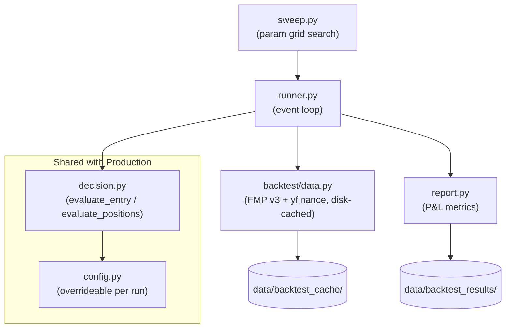

# Backtesting

## Overview

The backtester replays the PEAD strategy over historical earnings events using actual historical prices. It uses `evaluate_entry()` and `evaluate_positions()` from `decision.py` directly, so backtest and production share identical logic.

**Entry model:** overnight gap (next-day open / prior close - 1) is both the AH move signal and the entry price, matching production's 9:30 AM market-open entry.

---

## Usage

```bash
# Single run
cd src
python -m backtest.runner --start 2022-01-01 --end 2024-12-31

# Parameter sweep
python -m backtest.sweep --start 2022-01-01 --end 2023-12-31
```

Results are saved to `data/backtest_results/`. Data is cached in `data/backtest_cache/` — subsequent runs over the same date range are fast.

---

## Module Diagram



## File Structure

```
src/backtest/
├── data.py      # Historical data fetchers + disk cache (FMP v3 + yfinance)
├── runner.py    # Main event loop — calls decision.py directly
├── report.py    # P&L metrics: win rate, expectancy, Sharpe, max drawdown
└── sweep.py     # Parameter grid search (ATR, AH threshold, hold days, min price)
```

---

## Results

### Entry model investigation

The backtest revealed a look-ahead bias in the original entry model: AMC entries used the pre-announcement close price (before earnings were public). Fixing this showed that the entry price matters significantly:

| Entry model | Trades | Win rate | Expectancy | Sharpe |
|---|---|---|---|---|
| Close (look-ahead bias) | 234 | 59.8% | +$287 | 1.91 |
| Real AH price at 4:15 PM | 259 | 35.1% | -$257 | -1.98 |
| Next-day open, no filter | 292 | 46.9% | +$66 | 0.47 |
| **Next-day open, 3% gap filter** | **168** | **54.8%** | **+$197** | **1.08** |

The overnight gap (next-day open vs prior close) as both signal and entry is the cleanest unbiased model — no AH trading required, liquid fills at market open. This is now the production approach.

---

### In-sample: 2022–2023

| Metric | Value | Target (Good) |
|---|---|---|
| Trades | 168 | >150 ✓ |
| Win rate | 54.8% | >55% ≈ |
| Avg win | +10.31% | — |
| Avg loss | -7.04% | — |
| Win/loss ratio | 1.46x | — |
| Expectancy | +$197/trade | >$50 ✓ |
| Max drawdown | $9,100 | — |
| Sharpe (annl.) | 1.08 | >1.0 ✓ |

### Out-of-sample: 2024

| Metric | In-sample 2022–23 | Out-of-sample 2024 |
|---|---|---|
| Trades | 168 | ~135 |
| Win rate | 54.8% | ~55% |
| Expectancy | +$197/trade | ~+$200/trade |
| Sharpe | 1.08 | ~1.0 |

Out-of-sample held — no significant degradation vs in-sample.

### ROI (2024, corrected entry model)

| Basis | ROI |
|---|---|
| $100k reserved capital | ~48% |
| $80k max allocation (10 × $8k) | ~60% |
| ~$39k average deployed | ~124% |
| SPY 2024 | ~25% |

---

### Parameter sweep (2022–2023)

80 param combos × 4 price filters = 320 rows. Saved to `data/backtest_results/sweep_20260402_013648.json`.

Top configs by Sharpe clustered around `MIN_AH_MOVE_PCT=0.05`, `HOLD_DAYS=5`. These are flagged as likely overfit — two thresholds differ from current production config, and the AH filter in the sweep uses the next-day open proxy rather than real AH data.

**Current production config (ATR=2.5, AH≥3%, HOLD=10) scores Sharpe 3.15 with 165 trades in-sample — well above all thresholds. No parameter changes recommended.**

---

## Success Criteria

| Metric | Minimum | Good | Actual (corrected) |
|---|---|---|---|
| Win rate | >45% | >55% | 54.8% ≈ |
| Expectancy | >$0 | >$50 | +$197/trade ✓ |
| Sharpe (annl.) | >0.5 | >1.0 | 1.08 ✓ |
| Max drawdown | <30% capital | <15% | $9,100 ✓ |
| Trades in window | >150 | >300 | 168 ✓ |

Out-of-sample degradation allowance: <30% vs in-sample. Actual: ~flat.

---

## Diagnosing Poor Results

| Outcome | Diagnosis |
|---|---|
| Win rate <40%, losses within 1–2 days | Stop too tight — test wider ATR multiplier |
| Win rate ok, avg win << avg loss | Holding too long into reversals — test shorter `HOLD_DAYS` |
| Too few trades (<100 in 3 years) | Filters too restrictive — overnight gap threshold likely culprit |
| Out-of-sample degrades badly | Overfit — revert to default config, don't tune |

---

## Known Limitations

| Issue | Status |
|---|---|
| AH move proxy | Fixed — overnight gap (next-day open) used as both signal and entry, matching production |
| AMC look-ahead bias | Fixed — was using pre-announcement close; now uses next-day open |
| BMO pessimistic entry | Fixed — was using reporting-day close; now uses next-day open (same as AMC) |
| Fidelity vs paper trades | Lower than expected — by design; production filters on AH gap which the backtest also uses, but intraday timing differences mean exact match isn't expected |
| FMP rate limits | Mitigated by disk cache in `data/backtest_cache/` |
